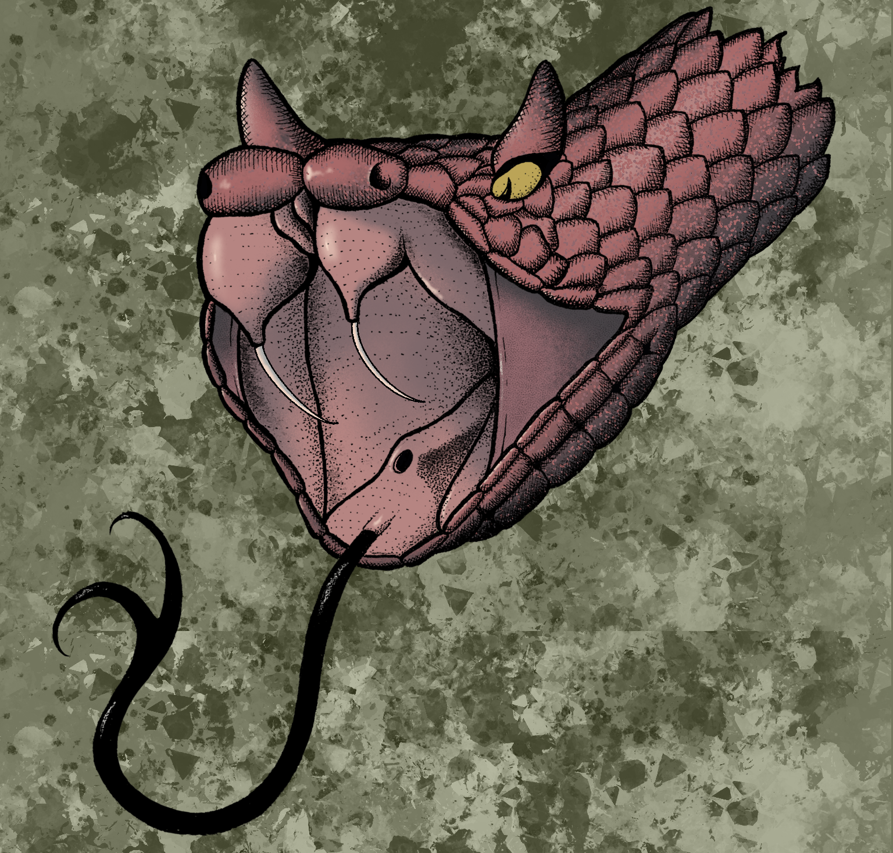

    
     
     
      
    

---
<h2>A little about me:</h2>
  <h3>I’m a software engineer in training based in New York City. I spend my free time drawing and painting. My goal is to combine my hobby with my proffession. I am looking to focus on Python and UX design ro help reach that goal.  </h3>

---

    <h3>Comfortable working in:</h3>
    
    
 

 ---

 
    
    
